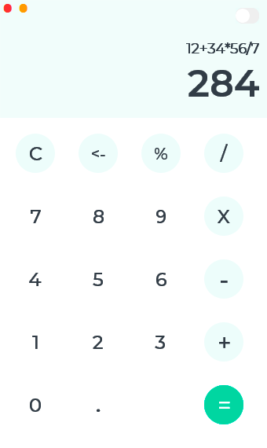
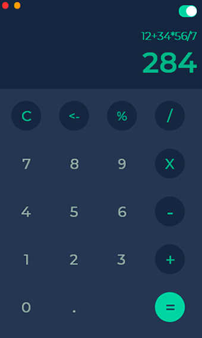

# SimpleCalculator

Java Calculator with Great UI

 

I invite you as well to see my [YouTube Tutorial](https://www.youtube.com/watch?v=3A0aPvHBHk0) (Spanish) in order to get to know the development process. 

## Features

* Great UI and UX.
* Light and dark mode.
* Addition, subtraction, multiplication, division and percentage.
* Results as you type.

## Getting Started

1. Download the repository files (project) from the download section or clone this project by typing in the bash the following command:
       git clone https://github.com/ricardo-alan/SimpleCalculator.git
2. Import it in NetBeans IDE or any other Java IDE.
3. Compile and run the application :-)

You can also open dist/Calculadora.jar 

## Thanks

Many thanks to [Wenhui Yu](https://dribbble.com/whyinteraction) for the base design.

## License

This project is licensed under the MIT License - see the [LICENSE.md](LICENSE.md) file for details
